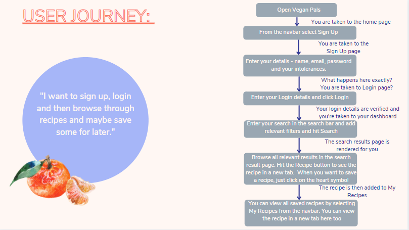
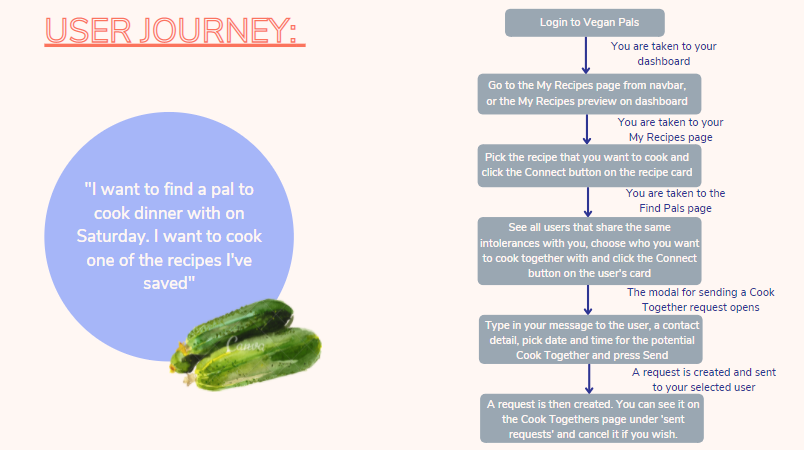
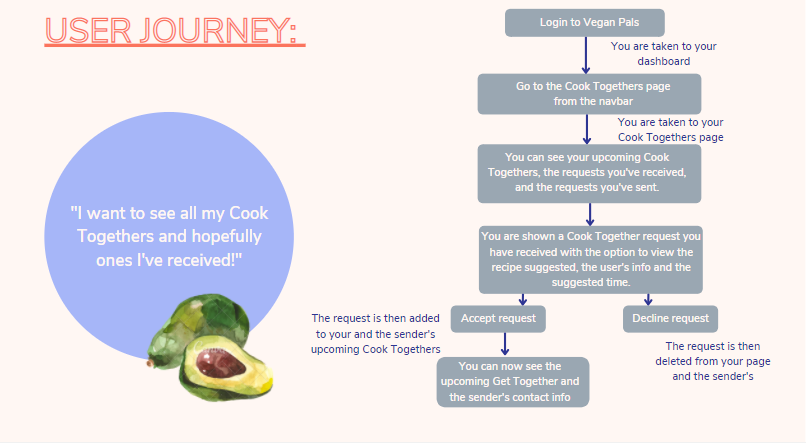

<h1>Vegan Pals</h1>

<h2> Table of Contents </h2>

- [Project Link](#project-link)
- [Getting Started](#getting-started)
- [Contributors](#contributors)
- [About the Project](#about-the-project)
  - [User Flows](#user-flows)
  - [Technologies Used](#technologies-used)
  - [Web APIs](#web-apis)
  - [Wireframes](#wireframes)
- [Plans for Improvement](#plans-for-improvement)
- [Screenshots](#screenshots)

## Project Link

Click [here](https://stormy-stream-13655.herokuapp.com/) to view the project on Heroku.

## Getting Started

- Clone the GitHub project into your local machine
- Navigate into the project

```
git clone https://github.com/dominikacookies/vegan-pals
cd vegan-pals
code .
```

## Contributors

- Dominika: https://github.com/dominikacookies
- Marcus: https://github.com/marcuslau0903
- Misha: https://github.com/misha244
- Syreeta:https://github.com/SyreetaC
- Otilia: https://github.com/otivisan22

## About the Project

The concept for this project was to develop an app on which me we can match users with the same intolerances and in that way they can cook together via online by scheduling a cooking session based on the recipes that they have saved and intolerances.

### User Flows






### Technologies Used

- MySQL
- CSS
- JS
- Handlebars
- Bootstrap 5
- Express
- jQuery
- Axios
- JSON
- bcrypt
- uuid

### Web APIs

We have used one API for this project

- [Food API and Recipe AP](https://spoonacular.com/food-api/)

### Wireframes


## Plans for Improvement

As a future plan we have decided to develop a Live Chat Box with emojis in order for the vegan pals to have a more easy way to communicate with each other. And also a save recipe button so that when you click on it will render users who also liked this recipe.

## Screenshots


